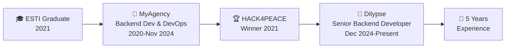

<div align="center">

# 🚀 Roméo Razafindrakoto


<p align="center">
  
  
</p>

---

*"Turning complex problems into elegant solutions, one line of code at a time"*

</div>

## 🌟 About Me

```javascript
const developer = {
    name: "Roméo Razafindrakoto",
    location: "🇲🇬 Madagascar",
    currentRole: "Senior Backend Developer",
    company: "Dilypse",
    experience: "5 years",
    education: "Computer Science Graduate - ESTI",
    
    achievements: {
        "🏆 HACK4PEACE 2021": "1st Place Winner with ZOTOMAHAY project",
        "💼 Professional": "Leading complex web architecture projects",
        "🎓 Academic": "Bachelor's in Computer Science (IDEV Track)",
        "📈 Career Growth": "Promoted to Senior Developer role"
    },
    
    passion: [
        "Building scalable web applications",
        "Solving complex technical challenges", 
        "Learning cutting-edge technologies",
        "Contributing to open source"
    ],
    
    philosophy: "Code with purpose, build with passion"
};
```

<div align="center">

## 🛠️ Tech Arsenal

### 💻 Backend Development


### 🎨 Frontend Technologies


### 🗄️ Databases


### ⚙️ DevOps & Cloud


### 💳 Payment Integration


</div>

## 📊 GitHub Analytics

<div align="center">


</div>

<div align="center">


</div>

<div align="center">


</div>

## 🚀 Featured Projects

<div align="center">

<table>
<tr>
<td align="center" width="50%">

### 🏢 CNaPS Website & CRM Overhaul
**Complete system modernization**

🔧 **Tech**: Symfony 4.4, MySQL, Docker  
📈 **Impact**: Enhanced performance & UX  
⚡ **Features**: Modern architecture, optimized workflows

[](https://github.com/dahromy)

</td>
<td align="center" width="50%">

### 🎉 Eventoo Platform
**Event management & payment integration**

🔧 **Tech**: PHP, Vue.js, Stripe API  
💳 **Features**: Payment processing, booking system  
🎯 **Focus**: Seamless user experience

[](https://github.com/dahromy)

</td>
</tr>
<tr>
<td align="center" width="50%">

### 🍽️ Restaurant Management System
**Microservices architecture**

🔧 **Tech**: Symfony, PostgreSQL, Docker  
🏗️ **Architecture**: Microservices, REST APIs  
📊 **Features**: Scalable, modular design

[](https://github.com/dahromy)

</td>
<td align="center" width="50%">

### 🏆 ZOTOMAHAY - HACK4PEACE Winner
**1st Place Innovation Project**

🏆 **Achievement**: HACK4PEACE 2021 Winner  
🌍 **Impact**: Social & peace-focused solution  
💡 **Innovation**: Creative problem-solving approach

[](https://github.com/dahromy)

</td>
</tr>
</table>

</div>

## 💼 Professional Journey

<div align="center">



</div>

**🚀 Senior Backend Developer (PHP/Symfony)** @ Dilypse *(December 2024 - Present)*

- 🏗️ **Senior Development**: Leading complex Symfony applications development and architecture decisions
- 🔧 **Advanced Solutions**: Implementing sophisticated backend solutions with PHP/Symfony
- 📊 **Performance Optimization**: Enhancing application performance and scalability

**💼 Backend Developer & DevOps Engineer** @ MyAgency *(2020 - November 2024)*

- 🏗️ **Architecture**: Designed and developed complex web applications using Symfony (4.4-7.1) & Laravel
- ⚙️ **DevOps**: Infrastructure setup, optimization, and automated deployments
- 🔌 **API Development**: RESTful APIs and third-party integrations
- 🗄️ **Database Management**: Multi-database expertise (MySQL, Oracle, MongoDB, PostgreSQL)
- 💳 **Payment Solutions**: Stripe & Mangopay integration
- 🖥️ **System Administration**: VPS management, Ubuntu server security
- 👥 **Technical Leadership**: Mentoring junior developers and code review processes

## 🎯 Current Focus & Learning

<div align="center">

| 🌱 Currently Learning | 🔬 Exploring | 🎯 Goals 2025 |
|----------------------|-------------|---------------|
| ☁️ Cloud Architecture | 🔄 CI/CD Pipelines | 🚀 Microservices Mastery |
| 📊 Performance Optimization | 🐳 Kubernetes | 🌐 Open Source Contributions |
| 🔒 Security Best Practices | 📈 Monitoring & Logging | 🎓 Cloud Certifications |

</div>

## 🏆 Achievements & Milestones

<div align="center">

| Achievement | Year | Description |
|------------|------|-------------|
| 🥇 **HACK4PEACE Winner** | 2021 | 1st Place with ZOTOMAHAY project |
| 🎓 **CS Degree** | 2021 | Bachelor's in Computer Science (ESTI) |
| 💼 **Professional Growth** | 2020+ | 5 years of backend development |
| 🚀 **Senior Role** | 2024 | Promoted to Senior Backend Developer at Dilypse |

</div>

## 🌐 Let's Connect & Collaborate

<div align="center">

[](mailto:romeorazaf@gmail.com)
[](https://www.linkedin.com/in/dahromy)
[](https://github.com/dahromy)

<br/>

**💬 Open to discuss:** *Web Development • DevOps • System Architecture • Open Source*

</div>

---

<div align="center">

### 💭 *"The best code is not just functional, but elegant, maintainable, and purposeful"*


**⭐ If you find my work interesting, consider giving it a star!**

*Last updated: May 22, 2025*

</div>
